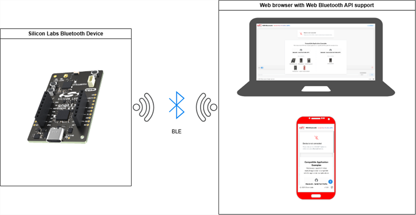
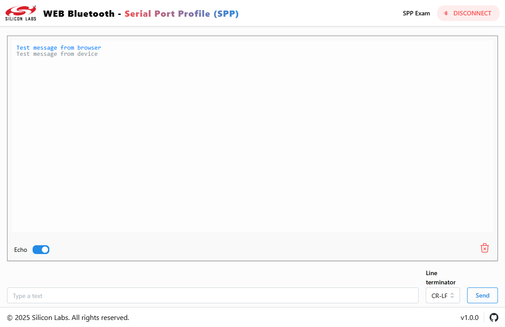

# Web Bluetooth - Serial Port Profile (SPP) Example
[](https://bridgethings.com)

## Overview

This example application implements the client-side device for the [Bluetooth - Serial Port Profile (SPP)](https://github.com/SiliconLabs/bluetooth_applications/tree/master/bluetooth_serial_port_profile) and [Bluetooth - Secure Serial Port Profile (SPP)](https://github.com/SiliconLabs/bluetooth_applications/tree/master/bluetooth_secure_spp_over_ble) application examples and provides an example to communicate Silicon Labs wireless microcontrollers using the BLE protocol from the Web Bluetooth API [compatible browsers](https://developer.mozilla.org/en-US/docs/Web/API/Web_Bluetooth_API#browser_compatibility).




The application runs in the browser as a Single Page Application (SPA) without requiring any server-side connection. 



> [!TIP]
Check out the live demo online: [https://siliconlabssoftware.github.io/web-bluetooth-spp-application/](https://siliconlabssoftware.github.io/web-bluetooth-spp-application/)

## Compatible Bluetooth SPP Application Examples
- [Bluetooth - Serial Port Profile (SPP)](https://github.com/SiliconLabs/bluetooth_applications/tree/master/bluetooth_serial_port_profile)
- [Bluetooth - Secure Serial Port Profile (SPP)](https://github.com/SiliconLabs/bluetooth_applications/tree/master/bluetooth_secure_spp_over_ble)

## Requirements
- Install [Nodejs >= v22.14.0 LTS](https://nodejs.org/en/download) 
- Prepare and flash a development kit with one of the [supported application examples](#compatible-bluetooth-spp-application-examples).

## Getting Started: Run the Application Locally

 1. Go to [project-root-folder]
 2. Open a Terminal/Cmd/PowerShell/Bash there
 3. Install the dependencies and run the application with the following commands
    ```bash
    # install all dependencies
    $ npm install

    # development
    $ npm run dev

    # production mode
    $ npm run build
    $ npm run preview
    ```
 4. Open the application in a web browser
> [!NOTE]  
> The local address of the application is displayed in the console once the server is up and ready to process the requests.
     
## Features

This example application comes with the following features:

- [React](https://react.dev/)
- [Mantine](https://mantine.dev/)
- [PostCSS](https://postcss.org/) with [mantine-postcss-preset](https://mantine.dev/styles/postcss-preset)
- [TypeScript](https://www.typescriptlang.org/)
- [Vitest](https://vitest.dev/) setup with [React Testing Library](https://testing-library.com/docs/react-testing-library/intro)
- ESLint setup with [eslint-config-mantine](https://github.com/mantinedev/eslint-config-mantine)

## npm scripts

### Build and dev scripts

- `dev` – start development server
- `build` – build production version of the app
- `preview` – locally preview production build
- `deploy` - deploys the application to the GitHub pages

### Testing scripts

- `typecheck` – checks TypeScript types
- `lint` – runs ESLint
- `prettier:check` – checks files with Prettier
- `vitest` – runs vitest tests
- `vitest:watch` – starts vitest watch
- `test` – runs `vitest`, `prettier:check`, `lint` and `typecheck` scripts

### Other scripts

- `prettier:write` – formats all files with Prettier

## Troubleshooting

Sometimes, when the application runs in Chrome Android and tries to pair and connect to a new device, the application cannot retrieve the GATT Service. To solve this issue, try to Unpair/Pair/Unpair the device in the Bluetooth settings. 

> [!IMPORTANT]  
> The device should be unpaired first to pair and connect via the application.


## Reporting Bugs/Issues and Posting Questions and Comments

To report bugs in the Application Examples projects, please create a new "Issue" in the "Issues" section of this repo. Please reference the board, project, and source files associated with the bug, and reference line numbers. If you are proposing a fix, also include information on the proposed fix. Since these examples are provided as-is, there is no guarantee that these examples will be updated to fix these issues.

Questions and comments related to these examples should be made by creating a new "Issue" in the "Issues" section of this repo.